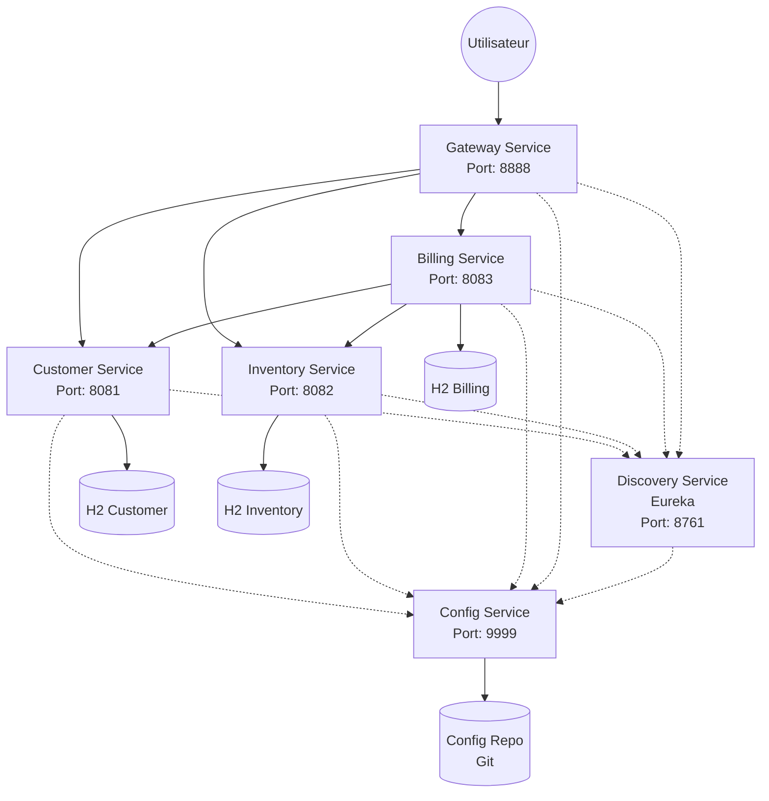
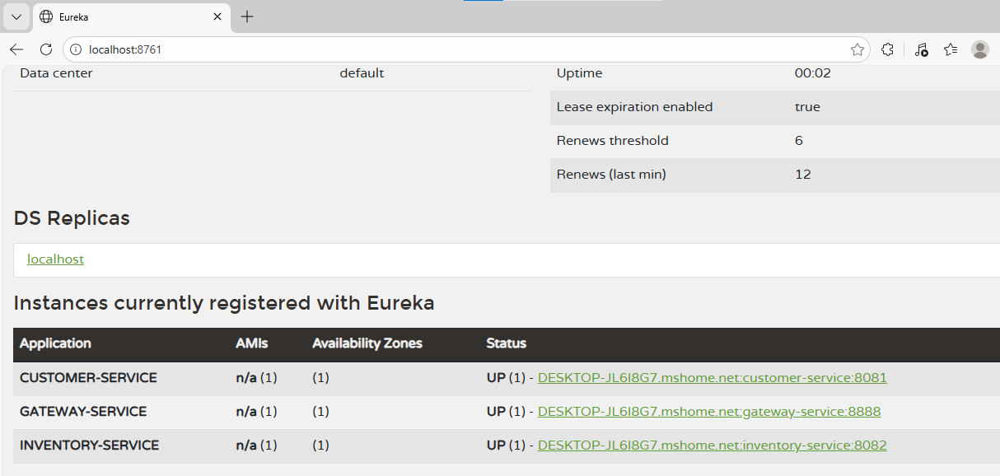
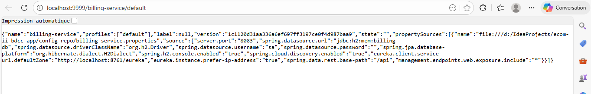
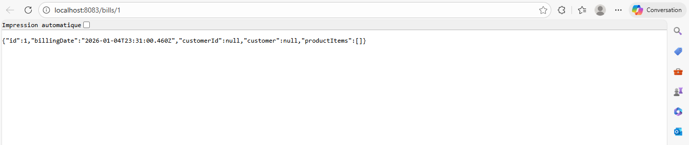
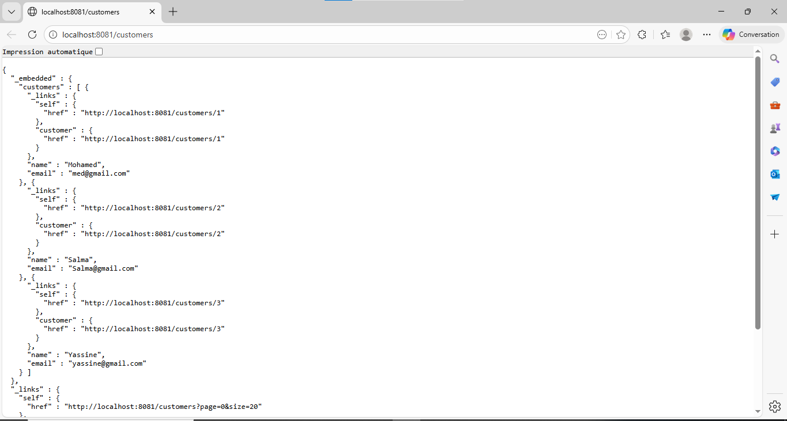
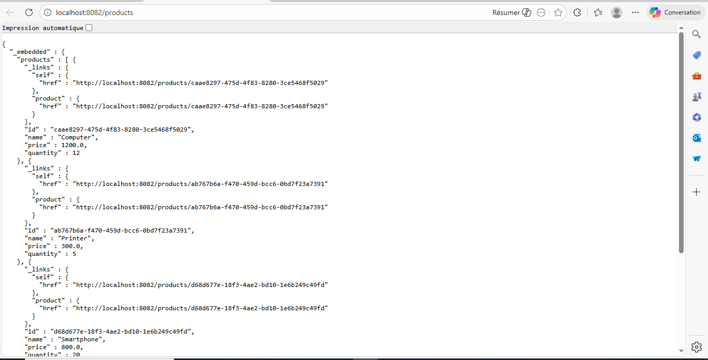
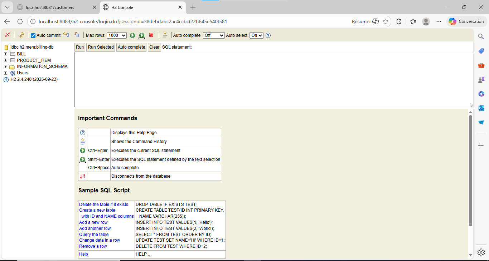

# Projet E-Commerce Microservices (Spring Cloud)

Ce projet est une application e-commerce distribuée basée sur une architecture microservices robuste utilisant l'écosystème Spring Boot et Spring Cloud.

## 🏗️ Architecture

Le système est composé de microservices autonomes interconnectés :

### Services implémentés :

1.  **Config Service** (Port 9999) : 
    -   Centralise les fichiers de configuration de tous les microservices via un dépôt Git local.
    -   Permet la modification dynamique de la configuration.
2.  **Discovery Service** (Port 8761) :
    -   Serveur Eureka pour l'enregistrement et la découverte dynamique des services.
3.  **Gateway Service** (Port 8888) :
    -   Point d'entrée unique basé sur Spring Cloud Gateway.
    -   Assure le routage vers les microservices.
4.  **Customer Service** (Port 8081) :
    -   Microservice de gestion des clients.
    -   Utilise Spring Data JPA et H2.
5.  **Inventory Service** (Port 8082) :
    -   Microservice de gestion des produits.
6.  **Billing Service** (Port 8083) :
    -   Service de facturation.
    -   Utilise **OpenFeign** pour communiquer avec *Customer-Service* et *Inventory-Service*.
    -   Agrège les données pour fournir une facture complète (Client + Produits).

## 🛠️ Stack Technique

*   **Java 21**
*   **Spring Boot 3.x**
*   **Spring Cloud 2023.x**
    -   Eureka Server/Client
    -   Config Server/Client
    -   OpenFeign
    -   Gateway
*   **Base de données** : H2 (In-memory)
*   **Build Tool** : Maven

## 📸 Démonstration et Captures d'écran

### 1. Eureka Discovery Service
Tableau de bord de surveillance montrant tous les services enregistrés et actifs.

### 2. Configuration Centralisée (Config Server)
Démonstration du `billing-service` récupérant sa configuration depuis le serveur centralisé (Git).

### 3. Billing Service (Facture Complète - OpenFeign)
Le résultat final de l'agrégation des données. Le service Récupère l'ID du client et des produits, puis interroge les autres services pour construire cet objet JSON complet.

### 4. Customer Service
API de gestion des clients (exposée via Spring Data REST).

### 5. Inventory Service
API de gestion de l'inventaire produits.

### 6. Console H2
Vérification des données persistées en mémoire.

## 🚀 Comment démarrer

1.  Cloner le dépôt.
2.  Démarrer les services dans l'ordre strict :
    -   `ConfigServiceApplication`
    -   `DiscoveryServiceApplication`
    -   `GatewayServiceApplication`
    -   `CustomerServiceApplication`
    -   `InventoryServiceApplication`
    -   `BillingServiceApplication`

## Auteurs
*   **Yassine** - *Étudiant Big Data & Cloud Computing*
